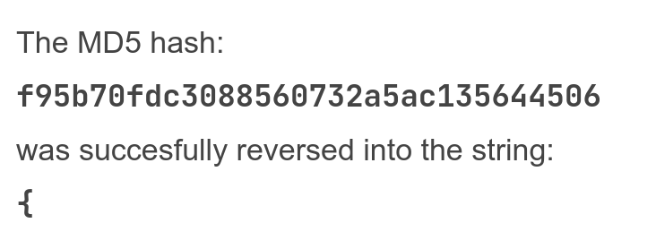

# Breakfast Club

Cryptography, 500- pts

> As the sysadmin for your college, you're responsible for overseeing the security of all the clubs. One of the on campus orginizations is a breakfast club with their own personal website that the leader insured you was "unhackable". He was so sure of this, that he sent you an example of how hashes are stored in the database, something about "changing the hash type multiple times for each password" or something like that. Can you crack the password and prove him wrong?

## Analysis

My first reaction to MD5 is to reverse lookup the hash, because MD5 is such an old and well-exploited hash algorithm already. This is what I found:



As the MD5 hash is the 5th in the list of hashes, I could guess that each hash corresponds to one character of the flag, and the 5th character is always `{`. Then the solution is probably to bruteforce each hash using a string of characters. I could skip the first 4 characters since it's just `PCTF`. 

## Solution

This can be automated with Python and the `pycryptodome` library. The script is shown below:

```python
from Crypto.Hash import MD5, SHA224, SHA256, SHA384, SHA512, SHA3_224, SHA3_256, SHA3_384, SHA3_512, TupleHash128, TupleHash256, BLAKE2s, BLAKE2b
import re
import string

flag = 'PCTF'
hasher = None
arr = []
hashes = ['MD5', 'SHA224', 'SHA256', 'SHA384', 'SHA512', 'SHA3_224', 'SHA3_256',
          'SHA3_384', 'SHA3_512', 'TupleHash128', 'TupleHash256', 'BLAKE2s', 'BLAKE2b']
bruter = string.ascii_letters + string.digits + "{}_-@#$%^*+"

with open('./BreakfastPasswords.txt', 'r') as f:
    arr = re.findall(r'[0-9a-f]{4,}', f.read())[4:]

assert len(hashes) == len(arr)
for i, _ in enumerate(arr):
    for c in bruter:
        exec(f"hasher = {hashes[i]}.new(); hasher.update(b'{c}')")
        if hasher.hexdigest() == arr[i]:
            flag += c
            break

print(flag)
```