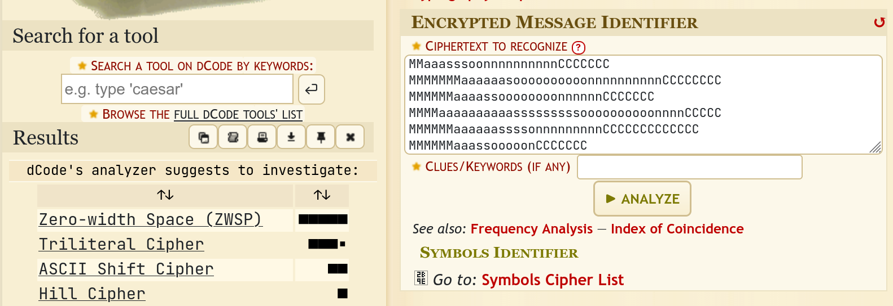
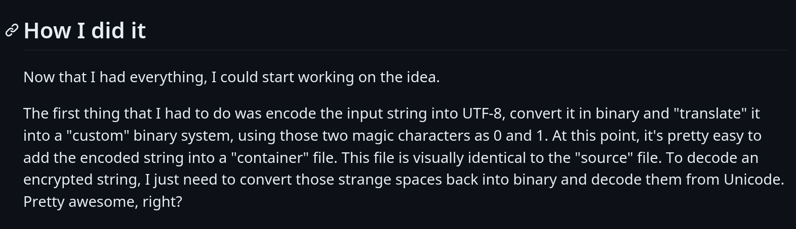
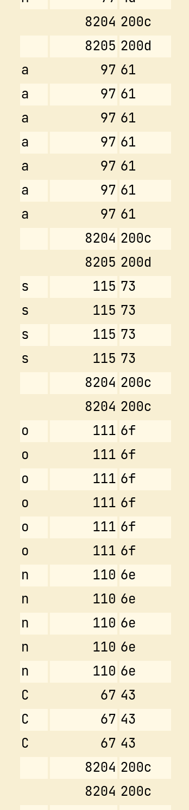
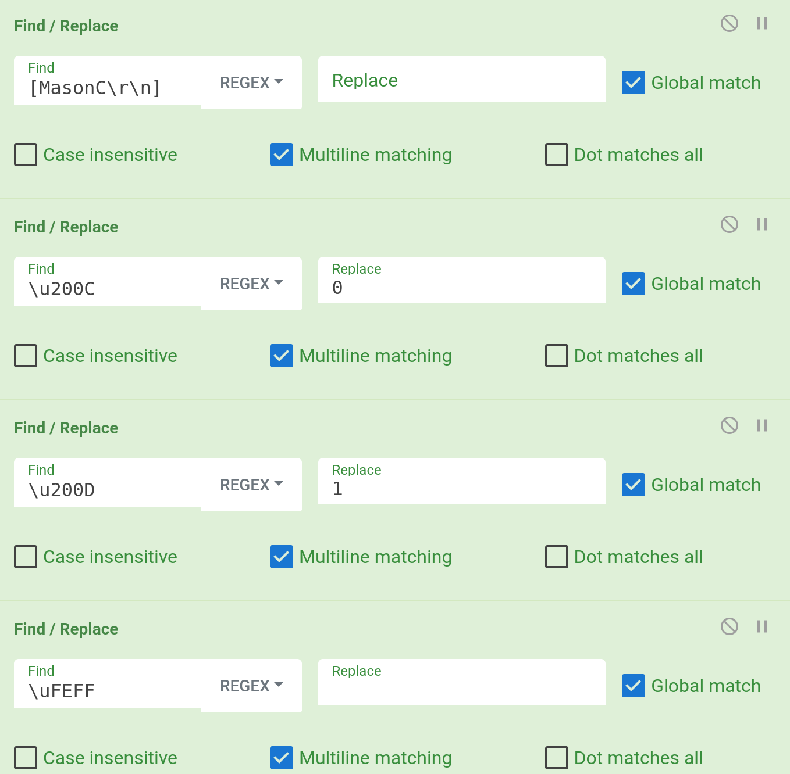

# Mason Competitive Cyber

Cryptography, 500- pts

> A member of our cyber club tried to be clever and send us a secret messed encoded using our club's name. We want to make sure it can't be deciphered if someone managed to get ahold of our message, can you try breaking the encoding for us?

## Analysis

When opening the text file, it appears like a very normal text file. However, when I traverse the text file with `Ctrl + Right`, the movement seems janky. It appears that there are hidden characters within the file.

So when I copied the text onto an analysis site like [dCode](https://www.dcode.fr/cipher-identifier), I get a result showing there are zero-width Unicode characters hidden within.

## Research

A teammate told me about zero-width steganography, so I searched for it on Google and found [this site](https://330k.github.io/misc_tools/unicode_steganography.html). However, it gave me a bunch of gibberish, so I was stuck at a dead end. I looked for various zero-width steganography tools, before finding [this GitHub repo](https://github.com/lorossi/zero-width-steganography) that goes into detail of how they made this tool. And reading their process, that was when it clicked:

Returning to the text file and analysing the zero-width characters, this appeared:

If `\u200C` is `0` and `\u200D` is `1`, then the encoded data is `01010000`, or the character `P`. That's the beginning of the flag!

## Solution

The solution involves three main steps:

* Removing all the visible characters and the `\r\n`s.
* Using RegEx to replace the invisible characters with `0`s and `1`s. (And the `\uFEFF`s can be replaced with whitespaces)
* Turn the binary into normal characters again.

All of this was done on [CyberChef](https://gchq.github.io/CyberChef/). My recipe is shown below.

The flag is revealed after running the recipe.