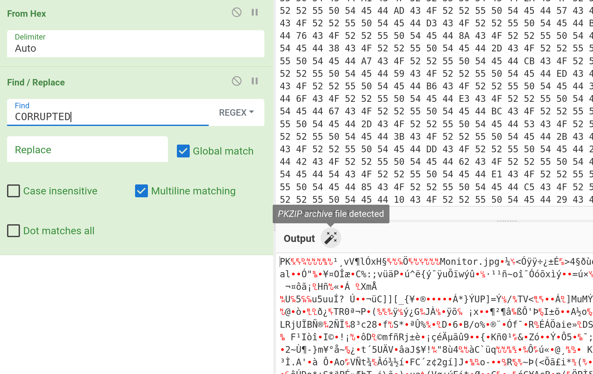
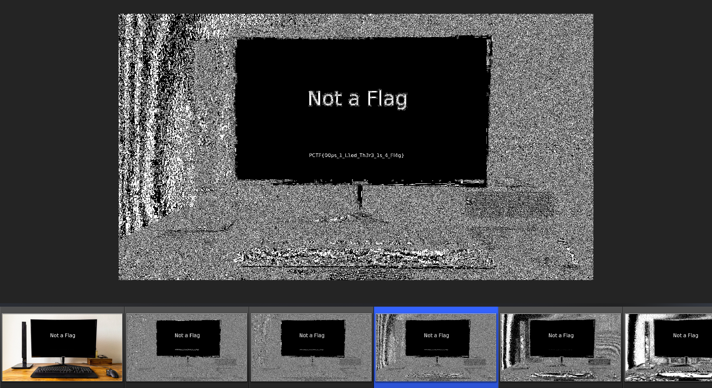

# Unsupported Format 2

Forensics, 500- pts

> My friend sent me a picture of his brand new computer, but something strange happened to it and now it says "Unsupported Format" when I try to open it.
> Can you try to help me recover the image?

## Analysis

When I woke up to do the challenge, my teammate had already done Unsupported Format 1. So apparently you had to use a hex editor to remove the bytes that spell out `CORRUPTED` in the image data in the first one, and I had not known about it. This made the solving process more difficult...

## Extraction

After the end of the JPEG, signified by the bytes `FF D9`, there is a lot of data, beginning with `PK` and laced with `CORRUPTED` repeatedly. I know the `PK` header usually signifies a ZIP format. So I just copied the raw data, put it onto CyberChef and used find and replace to clean it up, then downloaded the file. It really was a ZIP, so I extracted the ZIP to find an image.

## The image

Opening the image shows a monitor saying "Not a flag". So I used tools like `exiftool` and `steghide` for data, but could find none. So I used a more extensive tool, `stegoveritas`. This analyses the image on color planes and also does steganography. After running, it compiles all the results into a `results` folder, and as I look through the images...

Hello there!