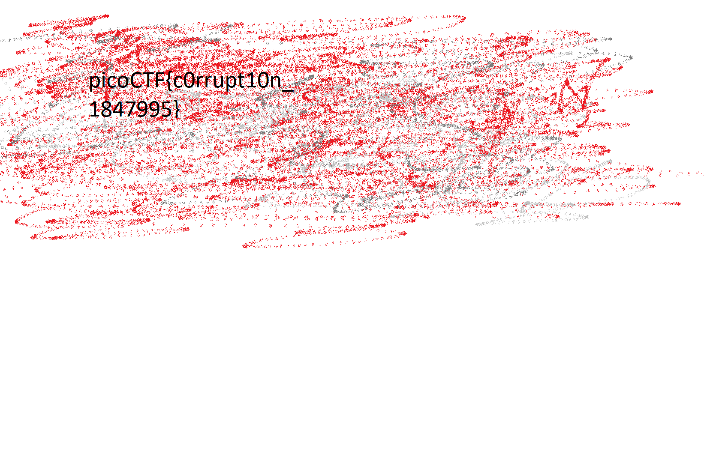

# c0rrupt

Forensics, 250 pts

> We found this file. Recover the flag.

There is not much detail about the challenge, other than the fact that we are given a file. Looking at the file, it seems that it is just data, until we look closer at the header.

```
Hex View  00 01 02 03 04 05 06 07  08 09 0A 0B 0C 0D 0E 0F
 
00000000  89 65 4E 34 0D 0A B0 AA  00 00 00 0D 43 22 44 52  .eN4........C"DR
00000010  00 00 06 6A 00 00 04 47  08 02 00 00 00 7C 8B AB  ...j...G.....|..
00000020  78 00 00 00 01 73 52 47  42 00 AE CE 1C E9 00 00  x....sRGB.......
00000030  00 04 67 41 4D 41 00 00  B1 8F 0B FC 61 05 00 00  ..gAMA......a...
00000040  00 09 70 48 59 73 AA 00  16 25 00 00 16 25 01 49  ..pHYs...%...%.I
00000050  52 24 F0 AA AA FF A5 AB  44 45 54 78 5E EC BD 3F  R$......DETx^..?
```

It seems that this is a corrupted header for a PNG file. By manually fixing the bytes, following the [PNG specification](http://www.libpng.org/pub/png/spec/1.2/PNG-Contents.html), we get a properly detected PNG image using the `file` command. However, when viewing the image, it seems to be cut, showing only part of the flag.


The image is not being properly displayed. By using `pngcheck`, it shows a problem with the filtering type:

```
mystery.png  private (invalid?) IDAT row-filter type (255) (warning)
mystery.png  private (invalid?) IDAT row-filter type (255) (warning)
mystery.png  private (invalid?) IDAT row-filter type (255) (warning)
mystery.png  private (invalid?) IDAT row-filter type (255) (warning)
mystery.png  private (invalid?) IDAT row-filter type (255) (warning)
```

The filtering type byte is probably corrupted, and should be set to 0. Looking online for solutions, I found [this GitHub repo](https://github.com/PotatoKingTheVII/png-filter-steg), which has the `ObscureDecoder` script that changes all filtering bytes to 0. After downloading and running the script, the image is recovered.



`picoCTF{c0rrupt10n_1847995}`